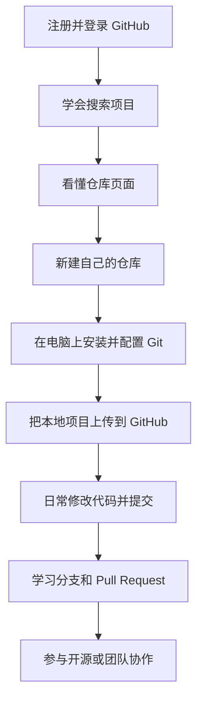
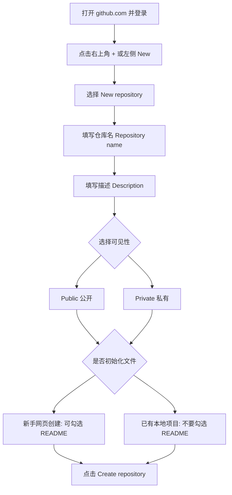
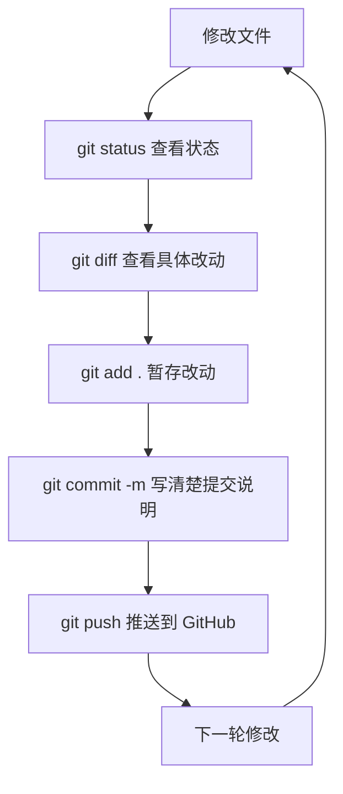
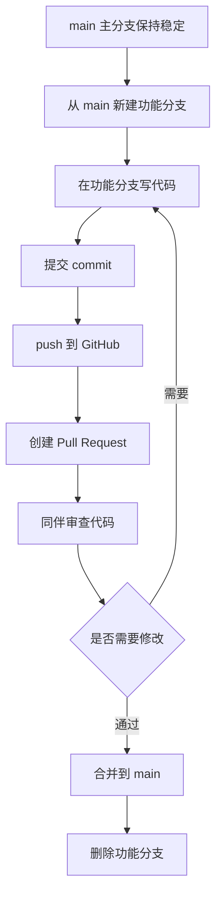
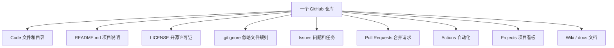

# GitHub 零基础完整入门指南

> 目标：让完全没用过 GitHub 的新手，能看懂 GitHub 是什么、怎么搜索项目、怎么新建仓库、怎么上传代码、怎么协作、怎么使用常见 Git 指令。

---
## 0. 先看懂 GitHub 的整体流程图

如果你是第一次接触 GitHub，先不要急着背命令。先把下面几张图看懂，你就知道每一步在干什么。

### 0.1 GitHub 学习路线总览



你可以把 GitHub 学习分成三层：

| 阶段 | 你要学会什么 | 关键动作 |
| --- | --- | --- |
| 入门 | 会找、会看、会收藏 | Search、README、Star |
| 上手 | 会建仓库、会上传 | New repository、commit、push |
| 进阶 | 会协作、会贡献 | Branch、Issue、Pull Request |

### 0.2 从网页新建仓库的流程图



重点记住：

- 如果你准备从零在网页上写项目，可以勾选 README。
- 如果你本地已经有项目，要上传到 GitHub，通常不要勾选 README、.gitignore、License，避免第一次 push 冲突。

### 0.3 本地项目上传到 GitHub 的流程图


对应命令就是：

```bash
git init
git add .
git commit -m "Initial commit"
git branch -M main
git remote add origin https://github.com/你的用户名/仓库名.git
git push -u origin main
```

### 0.4 Git 日常工作流结构图



日常开发其实就是不断循环：

```text
修改 -> 查看 -> 添加 -> 提交 -> 推送
```

### 0.5 多人协作流程图



这个流程可以避免大家直接修改 `main`，也方便检查代码质量。

### 0.6 仓库组成结构图



新手最先需要重点掌握这四个：

```text
Code：看代码在哪里
README.md：看项目怎么用
Issues：看别人遇到的问题
Pull Requests：看代码是怎么被合并的
```

---
## 1. Git 和 GitHub 到底是什么？

很多新手会把 **Git** 和 **GitHub** 混在一起，其实它们不是一个东西。

### 1.1 Git 是什么？

**Git 是一个版本管理工具。**

你可以把它理解成“代码的时间机器”：

- 你每完成一个阶段，就可以保存一次版本。
- 以后代码写坏了，可以回到之前的版本。
- 多个人可以同时开发，再把各自的修改合并起来。
- 它不只适合代码，也可以管理文档、配置文件、笔记等文本内容。

举个例子：

```text
作业.docx
作业-修改版.docx
作业-最终版.docx
作业-最终不改版.docx
作业-真的最终版.docx
```

Git 可以帮你避免这种混乱。你只需要一个项目文件夹，然后 Git 会记录每次修改。

### 1.2 GitHub 是什么？

**GitHub 是一个代码托管网站。**

你可以把它理解成“程序员的云盘 + 作品集 + 协作平台”：

- 把本地项目上传到 GitHub，防止电脑坏了代码丢失。
- 公开自己的项目，别人可以学习、点赞、提建议。
- 搜索别人开源的项目、代码、教程和工具。
- 多人一起开发项目，互相审查代码。
- 用 Issues 管理问题，用 Pull Requests 合并代码。

### 1.3 Git 和 GitHub 的关系

```text
Git：本地版本管理工具
GitHub：在线托管 Git 仓库的网站
```

你可以只用 Git 不用 GitHub，也可以用 GitHub Desktop/网页少写 Git 指令。但真正想熟练使用 GitHub，最好掌握基础 Git 指令。

---

## 2. GitHub 常见页面和术语

### 2.1 Repository / Repo / 仓库

**仓库就是一个项目的存放空间。**

一个仓库通常包含：

- 项目代码
- README 说明文档
- 配置文件
- 图片、脚本、测试文件
- 提交历史
- 分支
- Issue 和 Pull Request

例如：你做一个计算器项目，就可以建一个仓库叫 `calculator`。

### 2.2 Star

**Star 类似收藏/点赞。**

作用：

- 表示你喜欢这个项目。
- 以后可以在自己的 Star 列表里找到它。
- Star 越多，通常代表项目越受欢迎，但不代表一定适合你。

### 2.3 Fork

**Fork 是把别人的仓库复制一份到你的账号下。**

一句话理解：

```text
别人的仓库 -> Fork -> 你的 GitHub 账号下出现一个副本
```

#### Fork 为什么要这样操作？

因为你通常不能直接修改别人的仓库。Fork 的作用是先复制一份到你自己的账号下，你可以在自己的副本里随便改，不会影响原作者的项目。

Fork 常见用途：

- **学习代码**：把优秀项目 Fork 到自己账号下，慢慢研究。
- **二次开发**：基于别人的项目做自己的版本。
- **贡献开源**：修改后通过 Pull Request 请求原作者合并。
- **保存副本**：担心原项目以后删除，可以保留一份副本。

#### Fork 在哪里操作？

Fork 是 **GitHub 网页端操作**，不是本地终端命令。

操作步骤：

1. 打开别人的 GitHub 仓库页面。
2. 点击右上角 `Fork` 按钮。
3. 选择你的账号作为 Owner。
4. Repository name 可以保持原名，也可以改名。
5. 点击 `Create fork`。
6. 创建完成后，你会跳转到你自己账号下的新仓库。

例如：

```text
原仓库：https://github.com/original-owner/demo
Fork 后：https://github.com/your-name/demo
```

#### Fork 后通常还要做什么？

如果你只是在线查看，可以停在网页端。

如果你要在电脑上修改代码，还需要 **Clone 到本地**：

```bash
git clone https://github.com/你的用户名/仓库名.git
```

然后进入项目目录：

```bash
cd 仓库名
```

#### Fork、Clone、Download ZIP 的区别

| 操作 | 在哪里操作 | 得到什么 | 适合什么情况 |
| --- | --- | --- | --- |
| Fork | GitHub 网页端 | 你账号下的远程副本 | 想改别人的项目，或想给别人提交 PR |
| Clone | 本地终端 | 电脑上的完整 Git 仓库 | 想在本地开发、提交、同步更新 |
| Download ZIP | GitHub 网页端 | 一个普通压缩包 | 只想看代码或拿文件，不需要 Git 历史 |

Fork 之后，原仓库不会被你直接改动，你是在自己的副本里修改。
### 2.4 Clone

**Clone 是把远程仓库下载到你的电脑。**

例如：

```bash
git clone https://github.com/用户名/仓库名.git
```

Clone 后，你的电脑上会出现一个项目文件夹。

### 2.5 Commit

**Commit 是一次保存记录。**

每次 Commit 都应该说明你做了什么，例如：

```text
Add login page
Fix button style
Update README
```

新手可以理解为“给当前项目拍一张快照”。

### 2.6 Branch / 分支

**分支是独立开发线。**

常见分支：

- `main`：主分支，通常存放稳定代码。
- `dev`：开发分支。
- `feature/login`：某个具体功能分支。

使用分支可以避免直接把主分支搞坏。

### 2.7 Pull Request / PR

**PR 是请求把一个分支的代码合并到另一个分支。**

常见场景：

- 你 Fork 了别人项目，改完后向原项目发 PR。
- 团队成员在功能分支开发，完成后向 `main` 发 PR。

PR 页面可以讨论代码、审查修改、运行测试、最终合并。

### 2.8 Issue

**Issue 是问题、需求、任务的讨论区。**

可以用来：

- 报告 Bug。
- 提出新功能建议。
- 记录待办任务。
- 讨论项目计划。

### 2.9 Release

**Release 是项目的正式发布版本。**

比如：

```text
v1.0.0 第一个稳定版
v1.1.0 增加新功能
v1.1.1 修复 Bug
```

### 2.10 Actions

**GitHub Actions 是自动化工具。**

它可以自动：

- 运行测试。
- 构建项目。
- 发布网站。
- 打包软件。
- 检查代码格式。

---

## 3. 一个 GitHub 仓库通常由哪些部分组成？

打开一个仓库，你通常会看到这些部分。

### 3.1 Code

**Code 是仓库首页和文件列表。**

你可以在这里：

- 查看代码文件。
- 查看目录结构。
- 下载 ZIP。
- Clone 仓库。
- 切换分支。
- 查看最近提交。

### 3.2 README.md

**README 是项目说明书，通常是仓库最重要的文档。**

一个好的 README 应该说明：

- 项目是做什么的。
- 项目有什么功能。
- 如何安装。
- 如何运行。
- 如何使用。
- 项目目录结构。
- 常见问题。
- 作者和许可证。

`README.md` 使用 Markdown 语法编写。

### 3.3 LICENSE

**LICENSE 是开源许可证。**

它说明别人能不能使用、修改、分发你的项目。

常见许可证：

- MIT：非常宽松，适合大多数个人项目。
- Apache-2.0：宽松，并带有专利授权条款。
- GPL：要求衍生项目也开源。
- No license：没有许可证时，别人默认没有明确授权，不建议随便使用。

### 3.4 .gitignore

**.gitignore 用来告诉 Git 哪些文件不要上传。**

常见不上传的内容：

- 编译产物，如 `dist/`、`build/`。
- 依赖目录，如 `node_modules/`。
- 临时文件，如 `.DS_Store`。
- 密码、密钥、环境变量文件，如 `.env`。

示例：

```gitignore
node_modules/
dist/
.env
*.log
```

### 3.5 docs/

**docs 通常用来放文档。**

例如：

```text
docs/installation.md
docs/api.md
docs/faq.md
```

### 3.6 src/

**src 通常用来放源代码。**

例如：

```text
src/main.py
src/app.js
src/index.cpp
```

### 3.7 tests/

**tests 通常用来放测试代码。**

测试可以帮你检查代码是否正常工作。

### 3.8 Issues

**Issues 是项目问题列表。**

常见标签：

- `bug`：缺陷。
- `enhancement`：功能增强。
- `documentation`：文档问题。
- `good first issue`：适合新手贡献的问题。

### 3.9 Pull requests

**Pull requests 是代码合并请求列表。**

团队协作时，一般不是直接改 `main`，而是：

```text
新建分支 -> 修改代码 -> 提交 -> 发 PR -> 审查 -> 合并
```

### 3.10 Discussions

**Discussions 是讨论区。**

适合问答、想法交流、路线图讨论，不一定是明确 Bug。

### 3.11 Wiki

**Wiki 是项目知识库。**

适合放大量教程、设计说明、常见问题。

### 3.12 Projects

**Projects 是项目管理看板。**

可以像看板一样管理任务：

```text
To do -> In progress -> Done
```

### 3.13 Security

**Security 是安全相关页面。**

可以查看：

- 安全策略。
- 依赖漏洞提醒。
- 私密报告漏洞的入口。

### 3.14 Insights

**Insights 是仓库数据统计。**

可以查看：

- 提交活跃度。
- 贡献者。
- 流量。
- Fork 和 Star 趋势。

---

## 4. 如何搜索自己想要的东西？

GitHub 搜索非常强大，学会搜索，你就能找到很多优秀项目。

### 4.1 最基础搜索

进入 GitHub 首页顶部搜索框，输入关键词，例如：

```text
vue admin
python crawler
react dashboard
stm32 bootloader
machine learning
```

回车后，可以切换搜索类型：

- Repositories：搜索仓库。
- Code：搜索代码。
- Issues：搜索问题。
- Pull requests：搜索 PR。
- Discussions：搜索讨论。
- Users：搜索用户。

### 4.2 搜索仓库

如果你想找项目，优先看 Repositories。

可以关注这些指标：

- Stars：收藏数，越多通常越受欢迎。
- Forks：复制数，越多说明很多人在改或用。
- Last updated：最近更新时间，太久没更新的项目要谨慎。
- README：说明是否清楚。
- Issues：问题是否有人维护。
- License：许可证是否允许你使用。

### 4.3 常用搜索语法

#### 按语言搜索

```text
language:Python crawler
language:JavaScript dashboard
language:C bootloader
language:C++ game engine
```

#### 按 Star 数搜索

```text
stars:>1000 react admin
stars:>500 python spider
```

#### 按更新时间搜索

```text
pushed:>2025-01-01 vue3 admin
```

表示搜索 2025 年 1 月 1 日之后还更新过的项目。

#### 按仓库名搜索

```text
in:name blog
in:name dashboard
```

#### 按 README 搜索

```text
in:readme tutorial github
in:readme stm32
```

#### 按描述搜索

```text
in:description low code
in:description open source erp
```

#### 组合搜索

```text
vue3 admin language:TypeScript stars:>1000 pushed:>2025-01-01
python fastapi template stars:>500 pushed:>2025-01-01
stm32 bootloader language:C stars:>100
```

### 4.4 搜索代码

如果你想找某段代码怎么写，可以切换到 Code。

示例：

```text
filename:package.json vite react
filename:CMakeLists.txt stm32
extension:py requests beautifulsoup
```

常用语法：

```text
filename:文件名
extension:扩展名
path:目录
repo:用户名/仓库名
```

例如：

```text
repo:microsoft/vscode filename:package.json
```

### 4.5 如何判断一个项目值不值得学？

建议按这个顺序看：

1. README 是否清楚。
2. 最近是否还在维护。
3. Star 和 Fork 是否比较多。
4. Issues 是否有人回复。
5. 是否有安装和运行步骤。
6. 是否有 License。
7. 代码结构是否清晰。

不要只看 Star。一个项目 Star 很高，但多年不维护，也可能不适合新项目使用。

---

## 5. 如何一步步新建自己的 GitHub 仓库？

下面以网页端为例，适合新手。

### 5.1 注册或登录 GitHub

1. 打开 `https://github.com`。
2. 点击右上角 `Sign up` 注册，或 `Sign in` 登录。
3. 注册时需要邮箱、用户名、密码。
4. 登录后进入 GitHub 首页。

### 5.2 创建新仓库

1. 点击右上角 `+`。
2. 选择 `New repository`。
3. 填写 `Repository name`，例如：`my-first-repo`。
4. 填写 `Description`，例如：`My first GitHub repository`。
5. 选择可见性：
   - `Public`：公开，所有人都能看到。
   - `Private`：私有，只有你授权的人能看到。
6. 建议勾选 `Add a README file`。
7. 可以选择 `.gitignore` 模板，例如 Python、Node、Java。
8. 可以选择 License，例如 MIT。
9. 点击 `Create repository`。

### 5.3 仓库创建完成后你会看到什么？

你会看到：

- 仓库名称。
- 文件列表。
- README 内容。
- 绿色 `Code` 按钮。
- Issues、Pull requests、Actions 等标签。

### 5.4 新手推荐仓库设置

刚开始可以这样选：

```text
Repository name: my-first-repo
Description: My first GitHub repository
Visibility: Public
README: 勾选
.gitignore: 按你的语言选择；不确定可以先不选
License: MIT
```

---

## 6. 如何把本地项目上传到 GitHub？

假设你已经在 GitHub 创建了空仓库：

```text
https://github.com/你的用户名/my-first-repo
```

### 6.1 第一次配置 Git 用户信息

只需要在电脑上配置一次：

```bash
git config --global user.name "你的 GitHub 用户名"
git config --global user.email "你的邮箱"
```

查看配置：

```bash
git config --global --list
```

### 6.2 进入你的项目目录

```bash
cd 你的项目目录
```

Windows 示例：

```powershell
cd D:\projects\my-first-repo
```

### 6.3 初始化 Git 仓库

```bash
git init
```

### 6.4 查看当前状态

```bash
git status
```

### 6.5 添加文件到暂存区

添加全部文件：

```bash
git add .
```

只添加某个文件：

```bash
git add README.md
```

### 6.6 提交版本

```bash
git commit -m "Initial commit"
```

### 6.7 设置主分支名为 main

```bash
git branch -M main
```

### 6.8 关联远程仓库

```bash
git remote add origin https://github.com/你的用户名/my-first-repo.git
```

查看远程地址：

```bash
git remote -v
```

### 6.9 推送到 GitHub

```bash
git push -u origin main
```

第一次推送可能要求登录 GitHub。

---

## 7. 如何从 GitHub 下载别人的项目和文档？

下载之前先想清楚：你是只想看一眼，还是要长期学习和修改？不同目的对应不同方法。

### 7.1 三种下载方式怎么选？

| 目的 | 推荐方式 | 操作位置 | 是否保留 Git 历史 | 是否方便更新 |
| --- | --- | --- | --- | --- |
| 只想下载整个项目看一看 | Download ZIP | GitHub 网页端 | 否 | 不方便 |
| 想在本地运行、学习、修改 | git clone | 本地终端 | 是 | 方便 |
| 想修改后贡献给原作者 | Fork + Clone + PR | 网页端 + 本地终端 | 是 | 方便 |
| 只想下载某个单独文件 | Raw / Download raw file | GitHub 网页端 | 否 | 不方便 |
| 只想看项目文档 | 直接看 README / docs | GitHub 网页端 | 不涉及 | 不涉及 |

### 7.2 下载整个工程项目：Download ZIP

这是最简单的方法，不需要安装 Git。

**操作位置：GitHub 网页端。**

步骤：

1. 打开你想下载的 GitHub 仓库。
2. 点击绿色 `Code` 按钮。
3. 点击 `Download ZIP`。
4. 等待浏览器下载压缩包。
5. 解压 ZIP 文件。
6. 打开解压后的文件夹查看或运行项目。

适合：

- 只想快速看代码。
- 只想下载项目里的图片、文档、示例文件。
- 不准备提交修改。

不适合：

- 想长期跟踪项目更新。
- 想给项目提交 Pull Request。
- 想学习 Git 提交历史。

注意：ZIP 下载只是普通文件夹，没有 `.git` 历史，不能直接 `git pull` 更新。

### 7.3 下载完整工程项目：git clone

`git clone` 会把整个远程仓库复制到你的电脑，包括代码和 Git 提交历史。

**操作位置：本地电脑终端。**

步骤：

1. 打开别人的 GitHub 仓库页面。
2. 点击绿色 `Code` 按钮。
3. 复制 HTTPS 地址，例如：

```text
https://github.com/octocat/Hello-World.git
```

4. 在电脑上打开 PowerShell、CMD、Git Bash 或 VS Code 终端。
5. 进入你想保存项目的目录，例如：

```powershell
cd D:\projects
```

6. 执行 clone：

```bash
git clone https://github.com/octocat/Hello-World.git
```

7. 进入项目：

```bash
cd Hello-World
```

8. 查看文件：

```bash
dir        # Windows PowerShell/CMD
ls         # Git Bash / macOS / Linux
```

适合：

- 想在本地运行别人的项目。
- 想学习项目完整结构。
- 想以后用 `git pull` 拉取更新。
- 想查看提交历史。

更新别人项目的最新代码：

```bash
git pull
```

### 7.4 下载别人的文档

GitHub 项目文档常见位置：

```text
README.md              # 仓库首页说明
docs/                  # 文档目录
wiki                   # GitHub Wiki 页面
examples/              # 示例代码和示例文档
CHANGELOG.md           # 更新日志
CONTRIBUTING.md        # 贡献指南
```

#### 方法一：直接在网页端看文档

**操作位置：GitHub 网页端。**

步骤：

1. 打开仓库页面。
2. 先看首页自动显示的 `README.md`。
3. 如果有 `docs` 文件夹，点击进入。
4. 如果页面上方有 `Wiki`，点击查看 Wiki 文档。
5. 如果 README 里有目录链接，点击跳转到对应文档。

适合：只想阅读，不需要保存到电脑。

#### 方法二：下载单个文档文件

**操作位置：GitHub 网页端。**

步骤：

1. 打开某个 `.md`、`.txt`、`.pdf` 或代码文件。
2. 点击右上角的 `Raw` 或下载按钮。
3. 浏览器打开原始文件后，右键选择另存为。

适合：只想保存某一个文档。

#### 方法三：下载整个仓库里的全部文档

**操作位置：网页端或本地终端。**

如果不懂 Git，用 ZIP：

```text
Code -> Download ZIP -> 解压 -> 找 README.md 或 docs 文件夹
```

如果会 Git，用 clone：

```bash
git clone https://github.com/用户名/仓库名.git
```

然后在本地打开：

```text
README.md
docs/
```

### 7.5 Fork 别人项目并修改贡献

这是参与开源项目最常见的流程。

#### 第一步：Fork 原项目

**操作位置：GitHub 网页端。**

1. 打开原项目仓库。
2. 点击右上角 `Fork`。
3. 选择你的账号。
4. 点击 `Create fork`。

为什么要做这一步：你没有权限直接改原作者仓库，所以先复制一份到你账号下。

#### 第二步：Clone 你自己的 Fork

**操作位置：本地电脑终端。**

注意：这里 clone 的是你自己的 Fork，不是原作者仓库。

```bash
git clone https://github.com/你的用户名/仓库名.git
cd 仓库名
```

#### 第三步：新建分支再修改

**操作位置：本地电脑终端。**

```bash
git switch -c fix-typo
```

为什么要新建分支：不要直接在 `main` 上乱改，分支能让一次修改更清晰，也方便提交 PR。

#### 第四步：修改文件并提交

**操作位置：本地电脑终端 + 代码编辑器。**

```bash
git status
git add .
git commit -m "Fix typo in README"
```

#### 第五步：推送你的分支

**操作位置：本地电脑终端。**

```bash
git push -u origin fix-typo
```

#### 第六步：创建 Pull Request

**操作位置：GitHub 网页端。**

1. 打开你 Fork 后的仓库页面。
2. GitHub 通常会提示 `Compare & pull request`。
3. 点击它。
4. 确认方向是：

```text
你的分支 -> 原作者仓库的 main 分支
```

5. 写清楚你改了什么、为什么改。
6. 点击 `Create pull request`。

#### 第七步：等待作者审查

**操作位置：GitHub 网页端。**

作者可能会：

- 直接合并你的 PR。
- 评论让你继续修改。
- 关闭 PR。
- 暂时不处理。

如果作者让你修改，你继续在本地改，然后：

```bash
git add .
git commit -m "Update according to review"
git push
```

PR 页面会自动更新。

### 7.6 Fork 后如何同步原项目更新？

如果原作者项目更新了，你的 Fork 可能会落后。

#### 简单方法：网页端同步

**操作位置：GitHub 网页端。**

1. 打开你 Fork 后的仓库。
2. 如果看到 `Sync fork`，点击它。
3. 点击 `Update branch`。

#### 进阶方法：终端同步

**操作位置：本地电脑终端。**

第一次添加原仓库地址：

```bash
git remote add upstream https://github.com/原作者用户名/原仓库名.git
```

查看远程地址：

```bash
git remote -v
```

同步原仓库更新：

```bash
git switch main
git fetch upstream
git merge upstream/main
git push origin main
```

这里的含义：

- `origin`：你自己 Fork 的仓库。
- `upstream`：原作者的仓库。
- `fetch upstream`：把原作者更新拉下来。
- `merge upstream/main`：合并到你的本地 main。
- `push origin main`：推回你自己的 GitHub Fork。

---
## 7.7 哪些在网页端操作？哪些在本地终端操作？

这是新手最容易混的地方。记住一句话：

```text
GitHub 网页端负责：创建、查看、讨论、合并
本地电脑终端负责：下载、修改、提交、推送
```

### 网页端操作清单

这些操作一般在浏览器里的 GitHub 网站完成：

| 操作 | 在哪里点 | 为什么在网页端做 |
| --- | --- | --- |
| 注册/登录账号 | github.com | 账号属于 GitHub 网站 |
| 搜索项目 | 顶部搜索框 | GitHub 收录了所有公开仓库 |
| Star 收藏项目 | 仓库右上角 Star | 这是 GitHub 账号行为 |
| Fork 别人项目 | 仓库右上角 Fork | 复制远程仓库到你的账号下 |
| 新建仓库 | 右上角 `+` 或左侧 `New` | 远程仓库创建在 GitHub 服务器上 |
| 查看 README | 仓库首页 | GitHub 自动渲染 Markdown |
| 提 Issue | `Issues` 标签页 | 问题讨论发生在项目页面 |
| 创建 Pull Request | `Pull requests` 标签页 | 请求合并代码需要在 GitHub 上审查 |
| 合并 Pull Request | PR 页面 `Merge` 按钮 | 合并远程分支由 GitHub 执行 |
| 下载 ZIP | `Code -> Download ZIP` | 浏览器直接下载压缩包 |
| 同步 Fork | `Sync fork` | GitHub 可以在线同步原仓库更新 |

### 本地终端操作清单

这些操作一般在你电脑上的 PowerShell、CMD、Git Bash 或 VS Code 终端里完成：

| 命令 | 在哪里执行 | 作用 |
| --- | --- | --- |
| `git config` | 本地终端 | 配置你的 Git 用户名和邮箱 |
| `git clone` | 本地终端 | 把 GitHub 仓库下载到电脑 |
| `cd 项目目录` | 本地终端 | 进入项目文件夹 |
| `git init` | 本地终端 | 把普通文件夹变成 Git 仓库 |
| `git status` | 本地终端 | 查看哪些文件被修改 |
| `git diff` | 本地终端 | 查看文件具体改了什么 |
| `git add .` | 本地终端 | 把修改加入暂存区 |
| `git commit -m "说明"` | 本地终端 | 保存一个本地版本 |
| `git remote add origin 地址` | 本地终端 | 关联 GitHub 远程仓库 |
| `git push` | 本地终端 | 把本地提交上传到 GitHub |
| `git pull` | 本地终端 | 把 GitHub 最新内容拉到本地 |
| `git switch -c 分支名` | 本地终端 | 新建并切换分支 |
| `git merge 分支名` | 本地终端 | 合并本地分支 |

### 最常见的混合流程

很多 GitHub 操作是“网页端 + 本地终端”配合完成的。

#### 上传自己的新项目

```text
网页端：New repository 创建空仓库
本地终端：git init -> git add -> git commit -> git remote -> git push
网页端：刷新仓库页面，检查代码是否上传成功
```

#### 下载并运行别人的项目

```text
网页端：打开仓库，复制 Code 里的 HTTPS 地址
本地终端：git clone 地址
本地终端：进入项目并按照 README 安装运行
```

#### 给别人项目贡献代码

```text
网页端：Fork 原项目
本地终端：git clone 你的 Fork
本地终端：新建分支、修改、commit、push
网页端：创建 Pull Request
网页端：根据作者反馈继续修改或等待合并
```

#### 只下载文档

```text
网页端：直接看 README 或 docs
网页端：需要保存时点击 Raw 后另存为
网页端：需要全部文档时 Download ZIP
```

### 判断一个操作在哪里做的小技巧

- 要点按钮、看页面、写评论、创建 PR：通常在 **GitHub 网页端**。
- 要操作电脑里的文件、提交版本、上传下载代码：通常在 **本地终端**。
- 要写代码或改文档：通常在 **代码编辑器**，比如 VS Code。
- 要把本地改动同步到 GitHub：最后一定会用到 **`git push`**。
- 要把 GitHub 上的新内容同步到本地：通常用 **`git pull`**。

---
## 8. Git 常用指令大全

### 8.1 基础配置

```bash
git config --global user.name "你的名字"
git config --global user.email "你的邮箱"
git config --global --list
```

### 8.2 创建和查看仓库

```bash
git init                 # 初始化本地仓库
git status               # 查看当前状态
git log                  # 查看提交历史
git log --oneline        # 简洁查看提交历史
```

### 8.3 添加和提交

```bash
git add 文件名            # 添加指定文件
git add .                 # 添加全部修改
git commit -m "说明"      # 提交一次版本
```

### 8.4 分支操作

```bash
git branch                      # 查看本地分支
git branch 分支名                # 创建分支
git switch 分支名                # 切换分支
git switch -c 分支名             # 创建并切换分支
git merge 分支名                 # 合并指定分支到当前分支
git branch -d 分支名             # 删除本地分支
```

旧版 Git 也常用：

```bash
git checkout 分支名
git checkout -b 分支名
```

### 8.5 远程仓库操作

```bash
git remote -v                                      # 查看远程仓库
git remote add origin 仓库地址                      # 添加远程仓库
git push -u origin main                            # 第一次推送
git push                                           # 后续推送
git pull                                           # 拉取远程更新并合并
git fetch                                          # 只拉取，不自动合并
```

### 8.6 克隆仓库

```bash
git clone 仓库地址
```

### 8.7 撤销修改

撤销某个还没 add 的文件修改：

```bash
git restore 文件名
```

取消暂存：

```bash
git restore --staged 文件名
```

查看某个文件改了什么：

```bash
git diff 文件名
```

### 8.8 标签

```bash
git tag                         # 查看标签
git tag v1.0.0                  # 创建标签
git push origin v1.0.0          # 推送标签
git push origin --tags          # 推送所有标签
```

---

## 9. 一个标准开发流程

### 9.1 自己一个人开发

```bash
git status
git add .
git commit -m "Update feature"
git push
```

日常循环：

```text
修改文件 -> git status -> git add -> git commit -> git push
```

### 9.2 多人协作开发

推荐流程：

```text
1. 从 main 拉取最新代码
2. 新建功能分支
3. 在功能分支修改代码
4. 提交 commit
5. 推送分支到 GitHub
6. 创建 Pull Request
7. 代码审查
8. 合并到 main
```

对应指令：

```bash
git switch main
git pull
git switch -c feature/login
git add .
git commit -m "Add login feature"
git push -u origin feature/login
```

然后到 GitHub 页面创建 PR。

---

## 10. Markdown 基础语法

GitHub 的 README 通常用 Markdown 写。

### 10.1 标题

```markdown
# 一级标题
## 二级标题
### 三级标题
```

### 10.2 列表

```markdown
- 苹果
- 香蕉
- 西瓜
```

### 10.3 链接

```markdown
[GitHub](https://github.com)
```

### 10.4 图片

```markdown

```

### 10.5 代码块

````markdown
```python
print("hello")
```
````

### 10.6 表格

```markdown
| 名称 | 作用 |
| --- | --- |
| README.md | 项目说明 |
| LICENSE | 许可证 |
```

---

## 11. 新手常见问题

### 11.1 为什么 push 失败？

常见原因：

- 没有登录 GitHub。
- 远程地址写错。
- 当前分支名不是 `main`。
- 远程仓库已经有内容，本地没有先 pull。
- 没有权限推送到别人的仓库。

排查：

```bash
git remote -v
git branch
git status
git pull --rebase origin main
git push
```

### 11.2 main 和 master 有什么区别？

它们都是分支名。

以前很多项目默认叫 `master`，现在 GitHub 默认叫 `main`。新项目建议使用 `main`。

### 11.3 能不能上传大文件？

不建议直接上传很大的文件。

GitHub 普通仓库对大文件有限制。大文件建议使用：

- Git LFS
- 云盘
- Release 附件
- 对象存储

### 11.4 能不能上传密码？

绝对不要上传密码、Token、私钥、`.env` 文件。

如果不小心上传了：

1. 立刻删除并提交。
2. 去对应平台重置密码或 Token。
3. 如果已经进入历史记录，需要进一步清理 Git 历史。

### 11.5 Public 和 Private 怎么选？

- 学习项目、作品集、开源项目：可以 Public。
- 商业项目、课程作业、含隐私内容：建议 Private。

---

## 12. 推荐新手练习路线

### 第 1 天：会看

- 注册 GitHub。
- 搜索 5 个感兴趣项目。
- 学会看 README。
- 学会 Star 项目。

### 第 2 天：会建

- 新建自己的第一个仓库。
- 写 README。
- 添加 LICENSE。
- 添加 `.gitignore`。

### 第 3 天：会传

- 安装 Git。
- 配置用户名和邮箱。
- 本地 `git init`。
- `git add`、`git commit`、`git push`。

### 第 4 天：会改

- 修改 README。
- 再次提交。
- 查看提交历史。
- 学会回看 diff。

### 第 5 天：会协作

- Fork 一个仓库。
- Clone 到本地。
- 新建分支。
- 修改后提交 PR。

---

## 13. 建议你记住的最小命令集

如果你只想先记最常用的，记这些就够了：

```bash
git init
git status
git add .
git commit -m "说明"
git branch -M main
git remote add origin 仓库地址
git push -u origin main
git clone 仓库地址
git pull
git push
git switch -c 分支名
git switch main
```

---

## 14. 从零上传本仓库到你的 GitHub

如果你已经在 GitHub 创建了一个空仓库，比如：

```text
https://github.com/你的用户名/github-beginner-guide
```

在本目录执行：

```bash
git remote add origin https://github.com/你的用户名/github-beginner-guide.git
git branch -M main
git push -u origin main
```

如果提示远程仓库已有 README，可以先执行：

```bash
git pull --rebase origin main
git push -u origin main
```

---

## 15. 最后一句话

GitHub 的核心并不复杂：

```text
找项目：搜索 + Star + 阅读 README
建项目：New repository + README + LICENSE + .gitignore
传代码：git add + git commit + git push
协作：Branch + Pull Request + Issue
```

只要按这个流程练几遍，你就能从 GitHub 小白变成能独立使用 GitHub 的开发者。

