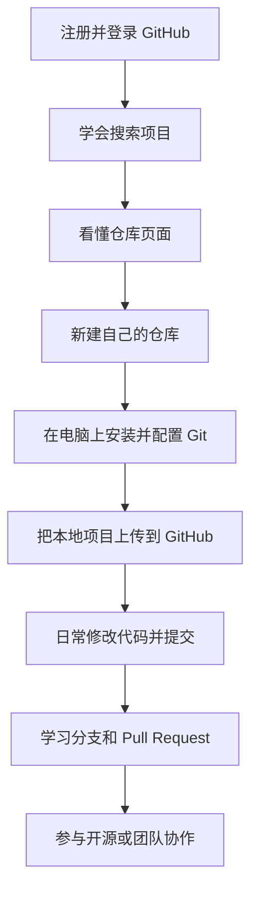
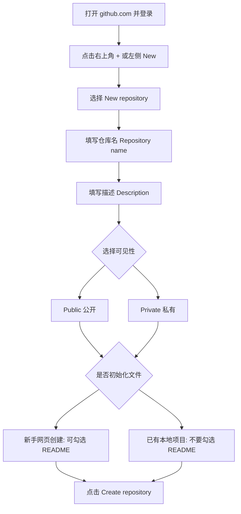
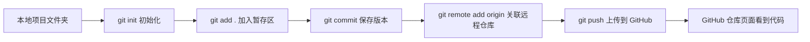
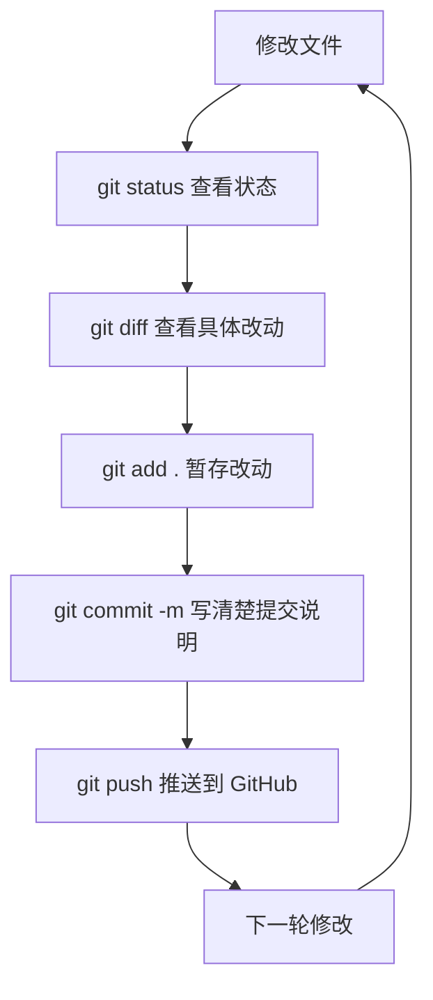
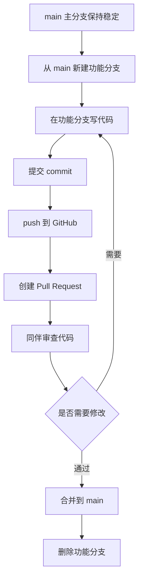
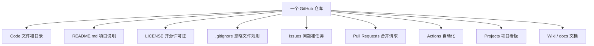

## 0. 先看懂 GitHub 的整体流程图

如果你是第一次接触 GitHub，先不要急着背命令。先把下面几张图看懂，你就知道每一步在干什么。

### 0.1 GitHub 学习路线总览



你可以把 GitHub 学习分成三层：

| 阶段 | 你要学会什么 | 关键动作 |
| --- | --- | --- |
| 入门 | 会找、会看、会收藏 | Search、README、Star |
| 上手 | 会建仓库、会上传 | New repository、commit、push |
| 进阶 | 会协作、会贡献 | Branch、Issue、Pull Request |

### 0.2 从网页新建仓库的流程图



重点记住：

- 如果你准备从零在网页上写项目，可以勾选 README。
- 如果你本地已经有项目，要上传到 GitHub，通常不要勾选 README、.gitignore、License，避免第一次 push 冲突。

### 0.3 本地项目上传到 GitHub 的流程图



对应命令就是：

```bash
git init
git add .
git commit -m "Initial commit"
git branch -M main
git remote add origin https://github.com/你的用户名/仓库名.git
git push -u origin main
```

### 0.4 Git 日常工作流结构图



日常开发其实就是不断循环：

```text
修改 -> 查看 -> 添加 -> 提交 -> 推送
```

### 0.5 多人协作流程图



这个流程可以避免大家直接修改 `main`，也方便检查代码质量。

### 0.6 仓库组成结构图



新手最先需要重点掌握这四个：

```text
Code：看代码在哪里
README.md：看项目怎么用
Issues：看别人遇到的问题
Pull Requests：看代码是怎么被合并的
```

---

---

[返回首页](../README.md) | [下一章：Git 和 GitHub 到底是什么？](01-git-vs-github.md)
